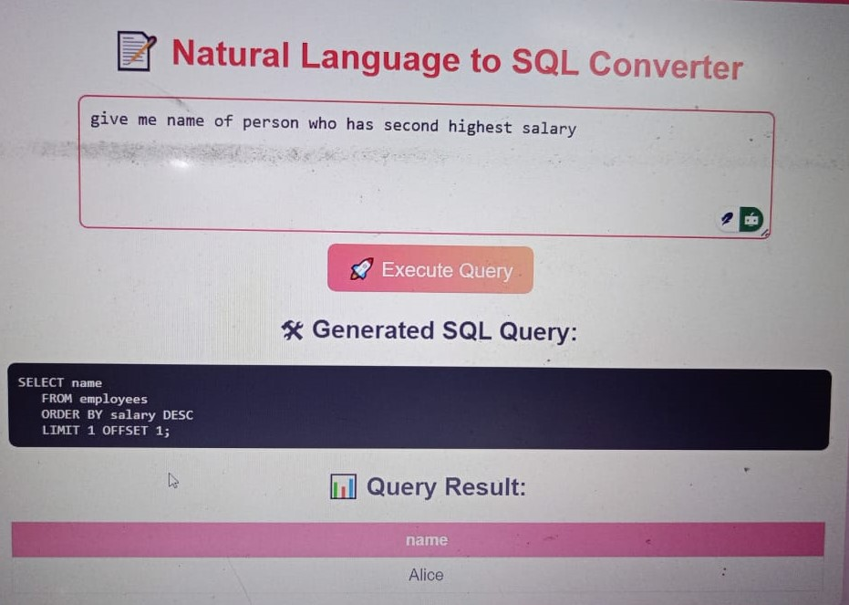

Natural Language to SQL Converter

This project converts natural language queries into SQL using the GEMINI API
It validates and fixes SQL queries based on the database schema, executes them on MySQL, and returns results in a table format

✍️ Converts Natural Language to SQL: Transforms queries like "give me name of person who has second highest salary" into executable SQL using the GEMINI API

📊 Dynamic Schema Validation: Fetches table and column names from a MySQL database to validate and fix generated SQL queries

🛠️ Error Handling: Corrects issues like incorrect table/column names and subquery errors (e.g., adding LIMIT 1 to subqueries)

🚀 Executes and Returns Results: Runs the SQL query on a MySQL database and returns results in a table format

🖼️ Demo

